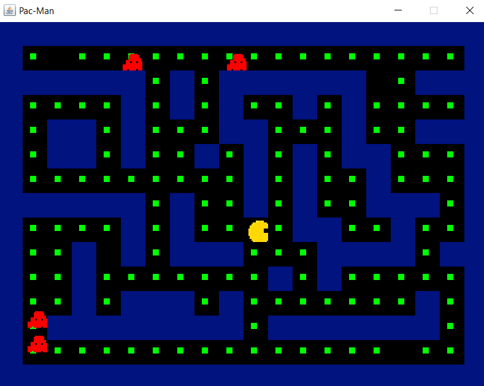

# Pac-Man: Java, AWT, paint.net 
Pac-man is a 2-D game, the basic objective of which is to make our protagonist aka Pac-Man
eat all the coins in a maze while being chased by 4 bots. The player has to navigate pac-man
through the maze and fool the ghosts while at the same time consuming coins. If the bots
catch up with pac-man, then the player loses the game. 

Bots and the player object is created using paint.net.  
Here's an image of final game:

## Future Improvements to make - 
1. A* instead of BFS
2. Add levels/ increase difficulty per level.
3. Change maze according to levels.
4. Animate pacman, improve the sprites. 

## Acknowledgement
The code is based on Yotube playlist: https://www.youtube.com/watch?v=_g2_KQIr2qk&list=PLD5R3cJr8wU2ZNZ-l5MKowc7sXwaV8hFg&index=1
Thanks to "Java Game Development" for the Pac-man tutorial.
